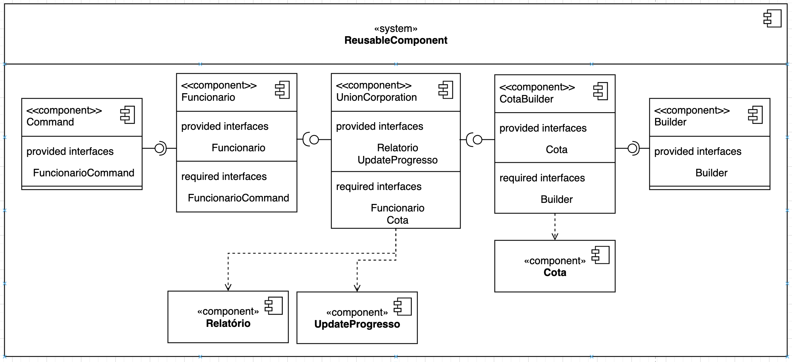

# OTES12 - PROVA 1

## GOF

Command e Builder

## Problemática


## Diagrama de classes


## Diagrama de componentes



## Código-fonte

Acesse [aqui](https://github.com/nataliaspeck/otes12-prova1/tree/main/prova/src) para visualizar o diretório contendo o código fonte

## Reutilização

Para rodar o arquivo, é necessário ter o Java 11 instalado em sua máquina (https://www.oracle.com/java/technologies/javase-jdk11-downloads.html) e no terminal, estando no diretório do arquivo, executar os comandos `javac UnionCorporation.java` e em seguida `java UnionCorporation`.

No arquivo `pom.xml` (ver [POM.XML](https://pt.wikipedia.org/wiki/Project_Object_Model)) do seu programa Java, após ter feito o download do Java e também do arquivo `.jar`: [prova.jar para fazer download](https://github.com/nataliaspeck/otes12-prova1/blob/main/out/artifacts/prova_jar/prova.jar), insira a seguinte dependência:

```
<dependency>
    <groupId>com.prova</groupId>
    <artifactId>prova</artifactId>
    <scope>system</scope>
    <systemPath>insira-aqui-o-caminho-para-o-.jar</systemPath>
</dependency>
```

Então, você terá disponível todas as classes do componente para utilizar em sua aplicação :)

O componente pode ser facilmente reutilizado por meio de modificações básicas que o desenvolvedor queira realizar nas classes de Cota e Funcionário e também de atualizações nas informações inseridas.
